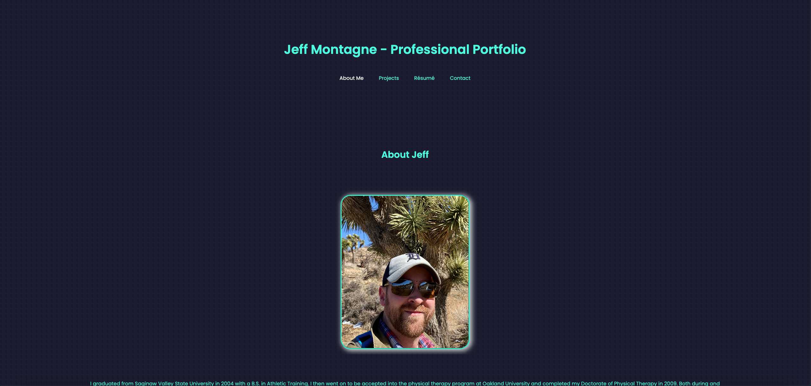

# React Portfolio

  
    
  ## Table of Contents

  * [Description](#description)
  * [Installation](#installation)
  * [Usage](#usage)
  * [License](https://choosealicense.com/licenses/MIT)
  * [Contributing](#contributing)
  * [Tests](#tests)
  * [Questions](#questions)
  
  ## [Description](#table-of-contents)

  This is my professional portfolio created with React, React-dom, React-icons, React-scripts, JavaScript, and CSS. It contains an About Me page, a page containing previous Projects, a Résumé page, and a Contact page. Read below to find the live deployed application. 

  ## [Installation](#table-of-contents)

  N/A

  ## [Usage](#table-of-contents)

  This application is deployed on [GitHub Pages](https://tagne13.github.io/React-Portfolio/)

  

  ## [License](#table-of-contents)

  The application is covered under the following license:
    
  [MIT](https://choosealicense.com/licenses/MIT)
    
  ## [Contributing](#table-of-contents)

  N/A

  ## [Tests](#table-of-contents)

  N/A

  ## [Questions](#table-of-contents)

  Please contact me using the following links:

  [GitHub](https://github.com/Tagne13)

  [Email: Tagne13@gmail.com](mailto:Tagne13@gmail.com)